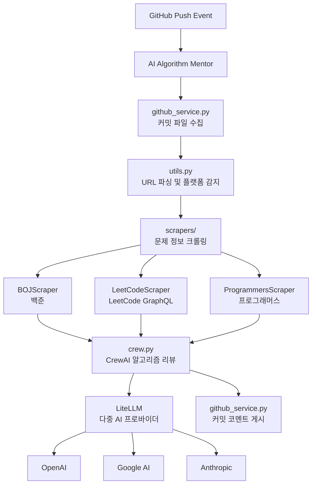

# 🤖 AI Algorithm Mentor

> **AI 기반 알고리즘 코드 리뷰 시스템**  
> 온라인 저지 플랫폼의 알고리즘 문제 풀이를 자동으로 분석하고 전문적인 피드백을 제공하는 GitHub Action

[](https://github.com/choam2426/AI-Algorithm-Mentor/releases)
[](https://opensource.org/licenses/MIT)
[](https://www.python.org/downloads/)

---

## ✨ 주요 기능

### 🧠 **지능형 코드 분석**
- 알고리즘 문제의 핵심 요구사항과 제약 조건 자동 파악
- 시간/공간 복잡도 분석 및 최적화 제안
- 코딩 컨벤션 및 가독성 개선 제안
- CrewAI 기반 전문 알고리즘 리뷰 에이전트

### 🔗 **Online Judge 자동 감지 & 크롤링**
- 변경 파일의 첫 줄 주석에서 문제 URL 자동 감지
- 문제 페이지를 크롤링해 제목/설명/입출력/예제를 자동 수집

### 💬 **자동 커밋 코멘트**
- LLM 결과를 GitHub Commit 코멘트로 자동 게시
- 여러 파일 동시 처리 (비동기 병렬 처리)

### 🌐 **다중 플랫폼 지원**
| 플랫폼 | 지원 상태 | URL 형식 |
|--------|----------|----------|
| **백준** (acmicpc.net) | ✅ 지원 | `https://www.acmicpc.net/problem/1000` |
| **LeetCode** (leetcode.com) | ✅ 지원 | `https://leetcode.com/problems/two-sum/` |
| **프로그래머스** (programmers.co.kr) | ✅ 지원 | `https://school.programmers.co.kr/learn/courses/30/lessons/12345` |

### 🤖 **다중 AI 모델 지원**
- **OpenAI** (GPT-5-nano, GPT-5.1)
- **Google AI** (Gemini-2.5-flash, Gemini-3-pro-preview)
- **Anthropic** (Claude-haiku-4-5, Claude-sonnet-4-5)

### 🌏 **다국어 리뷰**
- 리뷰 응답 언어 선택 가능
- 한국어, 영어 등 LLM이 지원하는 모든 언어

---

## 🚀 사용 방법

### 1. API 키 준비

지원하는 AI 제공자 중 하나의 API 키를 준비하세요:

| 제공자 | API 키 발급 | 환경변수명 |
|--------|------------|-----------|
| **OpenAI** | [OpenAI API](https://openai.com/api/) | `OPENAI_API_KEY` |
| **Google AI** | [Google AI Studio](https://aistudio.google.com/) | `GEMINI_API_KEY` |
| **Anthropic** | [Anthropic Console](https://console.anthropic.com/) | `ANTHROPIC_API_KEY` |

### 2. GitHub Repository 설정

1. **Secrets 등록**: Repository → Settings → Secrets and variables → Actions
   ```
   GEMINI_API_KEY=your_api_key_here  # 또는 다른 제공자의 API 키
   ```

2. **GitHub Action 워크플로우 생성**: `.github/workflows/ai-review.yml`
   ```yaml
   name: 🤖 AI Algorithm Mentor
   
   on:
     push:
       branches: [ main, master ]
   
   jobs:
     ai-review:
       runs-on: ubuntu-latest
       permissions:
         contents: write
       steps:
         - uses: choam2426/AI-Algorithm-Mentor@v5
           with:
             GITHUB_TOKEN: ${{ secrets.GITHUB_TOKEN }}
             LLM_PROVIDER: google              # openai, google, anthropic
             MODEL_NAME: gemini-3-pro-preview  # 모델명 (선택사항)
             GEMINI_API_KEY: ${{ secrets.GEMINI_API_KEY }}
             REVIEW_LANGUAGE: korean           # korean, english, etc..
   ```

### 3. 코드 작성 및 커밋

직접 커밋으로 알고리즘 문제 풀이를 올리면 자동으로 AI 리뷰가 생성됩니다!

❗❗❗코드의 첫 줄에는 반드시 해당 문제의 URL을 주석으로 추가해주세요!❗❗❗

---

## 📖 코드 예시

### 백준 (BOJ)
```python
# https://www.acmicpc.net/problem/1000
a, b = map(int, input().split())
print(a + b)
```

### LeetCode
```javascript
// https://leetcode.com/problems/two-sum/
var twoSum = function(nums, target) {
    const map = new Map();
    for (let i = 0; i < nums.length; i++) {
        const complement = target - nums[i];
        if (map.has(complement)) {
            return [map.get(complement), i];
        }
        map.set(nums[i], i);
    }
};
```

### 프로그래머스
```java
// https://school.programmers.co.kr/learn/courses/30/lessons/12345
class Solution {
    public int[] solution(int n, int[] arr) {
        // 풀이 코드
    }
}
```

---

## ⚙️ 설정 옵션

### 환경 변수

| 변수명 | 설명 | 기본값 | 예시 |
|--------|------|-------|------|
| `LLM_PROVIDER` | AI 제공자 | `google` | `openai`, `google`, `anthropic` |
| `MODEL_NAME` | 사용할 모델 | `gemini-3-pro-preview` | `gpt-5.1`, `gemini-3-pro-preview`, `claude-sonnet-4-5` |
| `REVIEW_LANGUAGE` | 리뷰 언어 | `korean` | `korean`, `english` |
| `OPENAI_API_KEY` | OpenAI API 키 | - | 필수 (openai 사용시) |
| `GEMINI_API_KEY` | Google AI API 키 | - | 필수 (google 사용시) |
| `ANTHROPIC_API_KEY` | Anthropic API 키 | - | 필수 (anthropic 사용시) |
| `GITHUB_TOKEN` | GitHub API 토큰 | GitHub Actions 기본 제공 | 커밋 코멘트 게시에 필요 |

---

## 🏗️ 아키텍처



### 프로젝트 구조

```
app/
├── main.py              # 엔트리포인트, 비동기 파일 처리
├── pyproject.toml       # 의존성 관리
└── src/
    ├── config.py        # GitHub/LLM 설정 관리
    ├── consts.py        # 상수 (지원 언어, LLM 프로바이더)
    ├── crew.py          # CrewAI 알고리즘 리뷰 에이전트
    ├── github_service.py # GitHub API 연동
    ├── logger.py        # 로깅
    ├── utils.py         # URL 파싱 유틸리티
    └── scrapers/
        ├── base.py      # 스크래퍼 베이스 클래스
        ├── factory.py   # 스크래퍼 팩토리
        ├── models.py    # Pydantic 데이터 모델
        ├── boj.py       # 백준 스크래퍼
        ├── leetcode.py  # LeetCode 스크래퍼
        └── programmers.py # 프로그래머스 스크래퍼
```

### 기술 스택

| 기술 | 용도 |
|------|------|
| **CrewAI** | AI 에이전트 프레임워크 |
| **LiteLLM** | 다중 LLM 프로바이더 지원 |
| **BeautifulSoup4** | HTML 파싱 및 웹 스크래핑 |
| **httpx** | 비동기 HTTP 클라이언트 |
| **Pydantic** | 데이터 모델링 및 검증 |

---

## 📋 지원 범위

### 프로그래밍 언어 (14개)
| 언어 | 확장자 | 주석 형식 |
|------|--------|----------|
| Python | `.py` | `#`, `"""`, `'''` |
| Java | `.java` | `//`, `/*` |
| C | `.c` | `//`, `/*` |
| C++ | `.cpp`, `.cc`, `.cxx` | `//`, `/*` |
| JavaScript | `.js` | `//`, `/*` |
| TypeScript | `.ts` | `//`, `/*` |
| Go | `.go` | `//`, `/*` |
| Rust | `.rs` | `//`, `/*` |
| C# | `.cs` | `//`, `/*` |
| Kotlin | `.kt`, `.kts` | `//`, `/*` |
| Ruby | `.rb` | `#`, `=begin` |
| Swift | `.swift` | `//`, `/*` |

### 문제 플랫폼
- ✅ **백준** (acmicpc.net)
- ✅ **LeetCode** (leetcode.com)
- ✅ **프로그래머스** (programmers.co.kr)

### 리뷰 언어
- 한국어, 영어 등 LLM이 지원하는 모든 언어

---

## 🤝 기여하기

1. Fork 후 feature branch 생성
2. 변경사항 구현 및 테스트
3. Pull Request 생성

### 개발 환경 설정

```bash
# Python 3.13+ 및 uv 필요
cd app
uv sync
```

---

## 📄 라이선스

이 프로젝트는 [MIT 라이선스](LICENSE) 하에 배포됩니다.

---

## 📞 문의

- **Issues**: [GitHub Issues](https://github.com/choam2426/AI-Algorithm-Mentor/issues)
- **개발자**: [choam2426](https://github.com/choam2426)

### 관련 프로젝트

- [사용 예시](https://github.com/choam2426/OnlineJudge) - 개발자가 실제 적용하고 있는 레포
