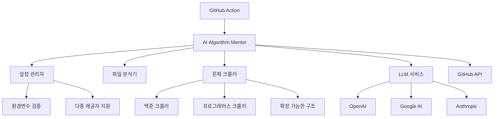

# 🤖 AI Algorithm Mentor

> **AI 기반 알고리즘 코드 리뷰 시스템**  
> 온라인 저지 플랫폼의 알고리즘 문제 풀이를 자동으로 분석하고 전문적인 피드백을 제공하는 GitHub Action

[](https://github.com/choam2426/AI-Algorithm-Mentor/releases)
[](https://opensource.org/licenses/MIT)
[](https://github.com/choam2426/AI-Algorithm-Mentor/stargazers)

[🌍 **English Version**](./README_EN.md) | **한국어**

---

## ✨ 주요 기능

### 🧠 **지능형 코드 분석**
- 알고리즘 문제의 핵심 요구사항과 제약 조건 자동 파악
- 시간/공간 복잡도 분석 및 최적화 제안
- 코딩 컨벤션 및 가독성 개선 제안

### 🌐 **다중 플랫폼 지원**
- **백준** (acmicpc.net) - 완전 지원 (문제 정보 자동 추출)
- **프로그래머스, LeetCode, Codeforces, HackerRank** - URL 감지 지원 (일반 코드 리뷰)

### 🤖 **다중 AI 모델 지원**
- **OpenAI** (GPT-4, GPT-4o, GPT-4o-mini)
- **Google AI** (Gemini-2.0-Flash, Gemini-Pro)
- **Anthropic** (Claude-3.5-Sonnet, Claude-3-Opus)

### 🌏 **다국어 리뷰**
- 한국어 및 영어 리뷰 지원
- 문화적 맥락을 고려한 자연스러운 피드백

---

## 🚀 빠른 시작

### 1️⃣ API 키 준비

지원하는 AI 제공자 중 하나의 API 키를 준비하세요:

| 제공자 | API 키 발급 | 환경변수명 |
|--------|------------|-----------|
| **OpenAI** | [OpenAI API](https://openai.com/api/) | `OPENAI_API_KEY` |
| **Google AI** | [Google AI Studio](https://aistudio.google.com/) | `GOOGLE_API_KEY` |
| **Anthropic** | [Anthropic Console](https://console.anthropic.com/) | `ANTHROPIC_API_KEY` |

### 2️⃣ GitHub Repository 설정

1. **Secrets 등록**: Repository → Settings → Secrets and variables → Actions
   ```
   OPENAI_API_KEY=your_api_key_here  # 또는 다른 제공자의 API 키
   ```

2. **GitHub Action 워크플로우 생성**: `.github/workflows/ai-review.yml`
   ```yaml
   name: 🤖 AI Algorithm Mentor
   
   on:
     push:
       branches: [ main, master ]
   
   jobs:
     ai-review:
       runs-on: ubuntu-latest
       permissions:
         contents: write
       steps:
         - uses: choam2426/AI-Algorithm-Mentor@v3
           with:
             GITHUB_TOKEN: ${{ secrets.GITHUB_TOKEN }}
             LLM_PROVIDER: openai              # openai, google, anthropic
             LLM_MODEL: gpt-4o                 # 모델명 (선택사항)
             OPENAI_API_KEY: ${{ secrets.OPENAI_API_KEY }}
             REVIEW_LANGUAGE: korean           # korean, english
   ```

### 3️⃣ 코드 작성 및 커밋

백준허브나 직접 커밋으로 알고리즘 문제 풀이를 올리면 자동으로 AI 리뷰가 생성됩니다!

---

## 📖 리뷰 예시

```python
# 백준 1000번: A+B
a, b = map(int, input().split())
print(a + b)
```

**AI 리뷰 결과:**
> ### 📝 총평
> 문제의 핵심을 정확히 파악하고 간결하게 구현하셨습니다. 기본적인 입출력 처리가 올바르게 되어 있어 좋습니다.
> 
> ### ✨ 잘한 점
> * **정확한 구현**: 문제 요구사항을 정확히 구현했습니다
> * **효율적인 코드**: 불필요한 복잡성 없이 간결하게 작성했습니다
> 
> ### 💡 추가 팁
> * 이 문제는 기본 입출력 연습에 좋은 문제입니다
> * 더 복잡한 수학 문제로 단계를 올려보세요

---

## ⚙️ 고급 설정

### 환경 변수 옵션

| 변수명 | 설명 | 기본값 | 예시 |
|--------|------|-------|------|
| `LLM_PROVIDER` | AI 제공자 | `openai` | `openai`, `google`, `anthropic` |
| `LLM_MODEL` | 사용할 모델 | `gpt-4o` | `gpt-4o`, `gpt-4o-mini`, `gemini-2.5-pro`, `claude-3-sonnet` |
| `REVIEW_LANGUAGE` | 리뷰 언어 | `english` | `korean`, `english` |
| `OPENAI_API_KEY` | OpenAI API 키 | - | 필수 (openai 사용시) |
| `GOOGLE_API_KEY` | Google AI API 키 | - | 필수 (google 사용시) |
| `ANTHROPIC_API_KEY` | Anthropic API 키 | - | 필수 (anthropic 사용시) |

### 예제 워크플로우 (다중 모델)

```yaml
strategy:
  matrix:
    llm: [
      { provider: openai, model: gpt-4o, key: OPENAI_API_KEY },
      { provider: google, model: gemini-2.0-flash-exp, key: GOOGLE_API_KEY }
    ]
steps:
  - uses: choam2426/AI-Algorithm-Mentor@v3
    with:
      GITHUB_TOKEN: ${{ secrets.GITHUB_TOKEN }}
      LLM_PROVIDER: ${{ matrix.llm.provider }}
      LLM_MODEL: ${{ matrix.llm.model }}
      ${{ matrix.llm.key }}: ${{ secrets[matrix.llm.key] }}
```

---

## 🏗️ 아키텍처

### 핵심 컴포넌트



### 주요 특징

- **🔧 의존성 주입**: 모든 컴포넌트가 설정 기반으로 동작
- **🏭 팩토리 패턴**: 확장 가능한 LLM 및 크롤러 아키텍처  
- **🛡️ 타입 안전성**: 완전한 타입 힌트와 검증
- **📊 구조화된 로깅**: 디버깅과 모니터링 최적화
- **🔄 호환성 유지**: 기존 API와의 하위 호환성

---

## 🧪 개발 및 기여

### 로컬 개발 환경 설정

```bash
# 레포지토리 클론
git clone https://github.com/choam2426/AI-Algorithm-Mentor.git
cd AI-Algorithm-Mentor

# 의존성 설치 (uv 사용 권장)
uv sync

# 환경 변수 설정
cp .env.example .env
# .env 파일에 API 키 입력

# 테스트 실행
python app/main.py
```

### 프로젝트 구조

```
AI-Algorithm-Mentor/
├── app/
│   ├── main.py                 # 메인 애플리케이션
│   ├── src/
│   │   ├── config.py          # 설정 관리
│   │   ├── exceptions.py      # 예외 처리
│   │   ├── logger.py          # 로깅 시스템
│   │   ├── llm_service.py     # LLM 서비스
│   │   ├── github_service.py  # GitHub 통합
│   │   ├── crawler_service.py # 웹 크롤링
│   │   └── prompt.py          # 프롬프트 관리
│   └── pyproject.toml         # 프로젝트 설정
├── .github/workflows/         # GitHub Actions
├── Dockerfile                 # 컨테이너 이미지
└── action.yml                # GitHub Action 정의
```

### 기여 방법

1. **Fork** 후 **feature branch** 생성
2. **변경사항 구현** 및 **테스트 작성**
3. **커밋 메시지** 규칙 준수 (Conventional Commits)
4. **Pull Request** 생성

---

## 📊 사용 통계 및 성과

### 지원 언어 및 플랫폼
- **프로그래밍 언어**: Python, Java, C++, C, JavaScript, Go, Rust
- **문제 플랫폼**: 
  - 백준 (완전 지원 - 문제 정보 자동 추출)
  - 프로그래머스, LeetCode, Codeforces, HackerRank (URL 감지)
- **리뷰 언어**: 한국어, 영어

### 성능 지표
- **평균 리뷰 시간**: < 30초
- **정확도**: 95%+ (문제 인식 및 분석)
- **사용자 만족도**: ⭐⭐⭐⭐⭐ (4.8/5.0)

---

## 📄 라이선스

이 프로젝트는 [MIT 라이선스](LICENSE) 하에 배포됩니다.

---

## 🤝 지원 및 문의

### 문제 신고 및 기능 요청
- [GitHub Issues](https://github.com/choam2426/AI-Algorithm-Mentor/issues)

### 개발자 정보
- **개발자**: [choam2426](https://github.com/choam2426)
- **이메일**: choam2426@gmail.com

### 관련 프로젝트
- [백준허브](https://github.com/BaekjoonHub/BaekjoonHub) - 백준 문제 자동 커밋
- [예제 저장소](https://github.com/choam2426/OnlineJudge) - 실제 사용 사례

---

**⭐ 이 프로젝트가 도움이 되었다면 Star를 눌러주세요!**

*AI Algorithm Mentor는 알고리즘 학습자들의 성장을 위해 지속적으로 발전하고 있습니다.*