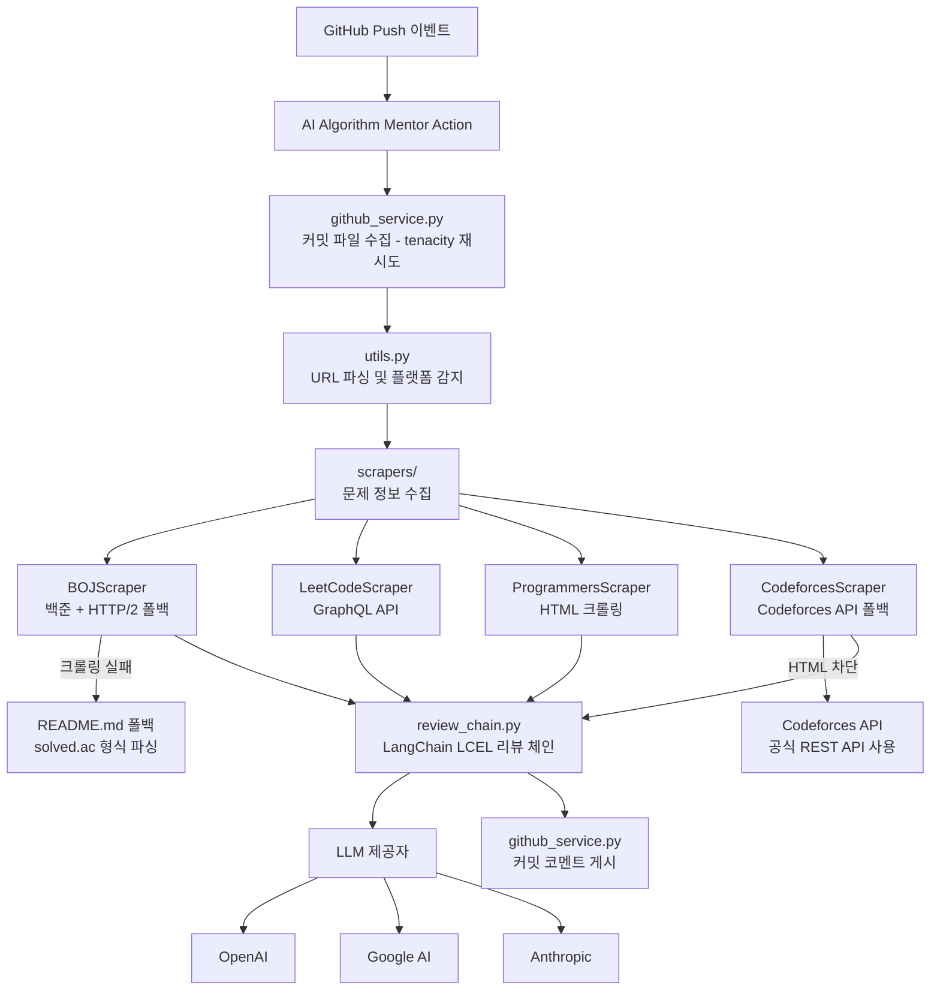

# AI Algorithm Mentor

> AI 기반 알고리즘 코드 리뷰 GitHub Action
> 알고리즘 문제 풀이를 커밋하면 자동으로 문제를 분석하고 전문적인 피드백을 달아줍니다.

[](https://github.com/choam2426/AI-Algorithm-Mentor/releases)
[](https://opensource.org/licenses/MIT)
[](https://www.python.org/downloads/)

한국어 | [English](README_EN.md)

---

## 주요 기능

- **지능형 코드 분석** — LangChain LCEL 기반 리뷰 체인이 시간/공간 복잡도, 정확성, 코드 품질을 분석합니다.
- **4개 플랫폼 자동 감지** — 코드 첫 줄 주석의 URL을 보고 플랫폼과 문제 번호를 자동으로 파악합니다.
- **문제 정보 자동 수집** — 문제 제목, 설명, 입출력, 예제를 크롤링해 리뷰에 활용합니다.
- **README.md 폴백** — 크롤링이 차단되면 같은 폴더의 `README.md`에서 문제 정보를 읽어옵니다.
- **자동 커밋 코멘트** — 리뷰 결과를 GitHub 커밋 코멘트로 자동 게시합니다.
- **병렬 처리** — 여러 파일이 포함된 커밋도 비동기로 동시에 처리합니다.
- **3종 AI 제공자** — OpenAI, Google AI, Anthropic 중에서 선택할 수 있습니다.
- **다국어 리뷰** — 한국어, 영어 등 LLM이 지원하는 언어로 리뷰를 받을 수 있습니다.

---

## 지원 플랫폼

| 플랫폼 | 지원 상태 | URL 예시 |
|--------|----------|---------|
| **백준** (acmicpc.net) | 지원 | `https://www.acmicpc.net/problem/1000` |
| **LeetCode** (leetcode.com) | 지원 | `https://leetcode.com/problems/two-sum/` |
| **프로그래머스** (programmers.co.kr) | 지원 | `https://school.programmers.co.kr/learn/courses/30/lessons/12345` |
| **Codeforces** (codeforces.com) | 지원 | `https://codeforces.com/problemset/problem/1/A` |

---

## 빠른 시작 (5분 설정)

### 1단계: API 키 준비

지원하는 AI 제공자 중 하나에서 API 키를 발급받으세요.

| 제공자 | 발급 링크 | GitHub Secret 이름 |
|--------|----------|-------------------|
| **Google AI** (기본값) | [Google AI Studio](https://aistudio.google.com/) | `GEMINI_API_KEY` |
| **OpenAI** | [OpenAI API](https://openai.com/api/) | `OPENAI_API_KEY` |
| **Anthropic** | [Anthropic Console](https://console.anthropic.com/) | `ANTHROPIC_API_KEY` |

### 2단계: GitHub Secret 등록

Repository → Settings → Secrets and variables → Actions → New repository secret

```
GEMINI_API_KEY = your_api_key_here
```

### 3단계: 워크플로우 파일 생성

`.github/workflows/ai-review.yml` 파일을 만들고 아래 내용을 그대로 붙여넣으세요.

```yaml
name: AI Algorithm Mentor

on:
  push:
    branches: [ main, master ]

jobs:
  ai-review:
    runs-on: ubuntu-latest
    permissions:
      contents: write
    steps:
      - uses: choam2426/AI-Algorithm-Mentor@v5
        with:
          GITHUB_TOKEN: ${{ secrets.GITHUB_TOKEN }}
          LLM_PROVIDER: google
          MODEL_NAME: gemini-3.1-flash
          GEMINI_API_KEY: ${{ secrets.GEMINI_API_KEY }}
          REVIEW_LANGUAGE: korean
```

### 4단계: 코드 작성 후 커밋

코드 첫 줄에 문제 URL을 주석으로 달고 커밋하면 됩니다. 자동으로 AI 리뷰가 생성됩니다.

> 첫 줄 URL 주석이 없으면 리뷰가 생성되지 않습니다.

---

## 코드 예시

### 백준 (BOJ)

```python
# https://www.acmicpc.net/problem/1000
a, b = map(int, input().split())
print(a + b)
```

### LeetCode

```javascript
// https://leetcode.com/problems/two-sum/
var twoSum = function(nums, target) {
    const map = new Map();
    for (let i = 0; i < nums.length; i++) {
        const complement = target - nums[i];
        if (map.has(complement)) return [map.get(complement), i];
        map.set(nums[i], i);
    }
};
```

### 프로그래머스

```java
// https://school.programmers.co.kr/learn/courses/30/lessons/12345
class Solution {
    public int[] solution(int n, int[] arr) {
        // 풀이 코드
    }
}
```

### Codeforces

```cpp
// https://codeforces.com/problemset/problem/1/A
#include <bits/stdc++.h>
using namespace std;
int main() {
    // 풀이 코드
}
```

---

## 설정 옵션

| 입력값 | 설명 | 기본값 |
|--------|------|-------|
| `LLM_PROVIDER` | AI 제공자 | `google` |
| `MODEL_NAME` | 사용할 모델명 | `gemini-3.1-flash` |
| `REVIEW_LANGUAGE` | 리뷰 언어 | `korean` |
| `OPENAI_API_KEY` | OpenAI API 키 | — |
| `GEMINI_API_KEY` | Google AI API 키 | — |
| `ANTHROPIC_API_KEY` | Anthropic API 키 | — |
| `GITHUB_TOKEN` | GitHub 토큰 (Actions에서 자동 제공) | — |

사용 가능한 모델 예시:

| 제공자 | 모델명 |
|--------|--------|
| Google | `gemini-3.1-flash`, `gemini-3.1-pro` |
| OpenAI | `gpt-5.4-mini`, `gpt-5.4-nano` |
| Anthropic | `claude-sonnet-4-6`, `claude-haiku-4-5` |

---

## 브라우저 익스텐션 권장 사항

**백준과 Codeforces는 GitHub Actions의 IP를 Cloudflare로 차단하는 경우가 있습니다.** 이런 경우 문제 정보를 직접 크롤링하지 못하고, 대신 솔루션 파일과 같은 폴더에 있는 `README.md`에서 문제 정보를 읽어오는 폴백 방식으로 작동합니다.

아래 익스텐션을 함께 사용하면 문제 정보가 담긴 `README.md`를 자동으로 생성해 주기 때문에 폴백이 자연스럽게 동작합니다.

### 백준: BaekjoonHub

[BaekjoonHub](https://github.com/BaekjoonHub/BaekjoonHub) — 백준에서 문제를 맞히면 소스코드와 함께 문제 설명이 담긴 `README.md`를 자동으로 GitHub에 푸시해 줍니다.

- Cloudflare 차단 우회에 가장 효과적인 방법입니다.
- 설치 링크: [Chrome 웹 스토어](https://chromewebstore.google.com/detail/baekjoonhub/ccammcjdkpgjmcpijpahlehmapgmphmk?hl=ko)

### Codeforces: CFPusher

[CFPusher](https://chromewebstore.google.com/detail/cfpusher-codeforces-to-gi/eiffefcjnaanflbhcmgjlaoilhpkbael) — Codeforces에서 정답을 받으면 소스코드를 자동으로 GitHub에 푸시해 줍니다.

- Codeforces는 비브라우저 요청을 차단하는 경우가 많아 익스텐션 사용을 강력히 권장합니다.
- 익스텐션이 올린 파일에 URL 주석이 포함되어 있으면 리뷰가 자동 시작됩니다.

> **폴백 동작 방식**: 크롤링 실패 시 → 솔루션 파일과 같은 폴더의 `README.md` 확인 → 문제 설명 파싱 → 리뷰 진행. `README.md`도 없으면 해당 파일은 건너뜁니다.

---

## 적용 예시

- [예시 1 — 백준 리뷰](https://github.com/choam2426/OnlineJudge/commit/09d4753fb1957cf70188a9d8fdbd3873e925a778#commitcomment-172865735)
- [예시 2 — LeetCode 리뷰](https://github.com/choam2426/OnlineJudge/commit/0e0e8c94dabf407a38a559c52eb19a3cebe8adda#commitcomment-172867307)
- [실제 적용 레포](https://github.com/choam2426/OnlineJudge)

---

## 아키텍처


```mermaid
graph TD
    A[GitHub Push 이벤트] --> B[AI Algorithm Mentor Action]
    B --> C[github_service.py<br/>커밋 파일 수집 - tenacity 재시도]
    C --> D[utils.py<br/>URL 파싱 및 플랫폼 감지]
    D --> E[scrapers/<br/>문제 정보 수집]

    E --> E1[BOJScraper<br/>백준 + HTTP/2 폴백]
    E --> E2[LeetCodeScraper<br/>GraphQL API]
    E --> E3[ProgrammersScraper<br/>HTML 크롤링]
    E --> E4[CodeforcesScraper<br/>Codeforces API 폴백]

    E1 -->|크롤링 실패| F1[README.md 폴백<br/>solved.ac 형식 파싱]
    E4 -->|HTML 차단| F2[Codeforces API<br/>공식 REST API 사용]

    E1 & E2 & E3 & E4 --> G[review_chain.py<br/>LangChain LCEL 리뷰 체인]

    G --> H[LLM 제공자]
    H --> H1[OpenAI]
    H --> H2[Google AI]
    H --> H3[Anthropic]

    G --> I[github_service.py<br/>커밋 코멘트 게시]
```

---

## 프로젝트 구조

```
app/
├── main.py                  # 엔트리포인트, 비동기 병렬 파일 처리
├── pyproject.toml           # 의존성 관리
└── src/
    ├── config.py            # GitHub / LLM 설정
    ├── consts.py            # 지원 언어, 제공자 상수
    ├── review_chain.py      # LangChain LCEL 리뷰 체인
    ├── github_service.py    # GitHub API 연동 (tenacity 재시도)
    ├── logger.py            # 로깅
    ├── utils.py             # URL 파싱, README 파싱 유틸리티
    └── scrapers/
        ├── base.py          # 스크래퍼 베이스 클래스
        ├── factory.py       # 플랫폼별 스크래퍼 선택
        ├── models.py        # Pydantic 데이터 모델
        ├── boj.py           # 백준 스크래퍼 (HTTP/1.1 + HTTP/2 폴백)
        ├── leetcode.py      # LeetCode GraphQL 스크래퍼
        ├── programmers.py   # 프로그래머스 HTML 스크래퍼
        └── codeforces.py    # Codeforces 스크래퍼 (API 폴백)

tests/
└── ...                      # pytest 단위 테스트 (32개)
```

---

## 기술 스택

| 기술 | 용도 |
|------|------|
| **LangChain LCEL** | LLM 리뷰 체인 구성 |
| **httpx** | 비동기 HTTP 클라이언트 (HTTP/2 지원) |
| **BeautifulSoup4** | HTML 파싱 및 웹 스크래핑 |
| **Pydantic** | 데이터 모델링 및 검증 |
| **tenacity** | GitHub API 재시도 로직 |
| **pytest** | 단위 테스트 (32개) |

---

## 지원 언어

| 언어 | 확장자 | 주석 형식 |
|------|--------|----------|
| Python | `.py` | `#`, `"""`, `'''` |
| Java | `.java` | `//`, `/*` |
| C | `.c` | `//`, `/*` |
| C++ | `.cpp`, `.cc`, `.cxx` | `//`, `/*` |
| JavaScript | `.js` | `//`, `/*` |
| TypeScript | `.ts` | `//`, `/*` |
| Go | `.go` | `//`, `/*` |
| Rust | `.rs` | `//`, `/*` |
| C# | `.cs` | `//`, `/*` |
| Kotlin | `.kt`, `.kts` | `//`, `/*` |
| Ruby | `.rb` | `#`, `=begin` |
| Swift | `.swift` | `//`, `/*` |

---

## 기여하기

1. 이 저장소를 Fork합니다.
2. feature 브랜치를 만듭니다: `git checkout -b feature/my-feature`
3. 변경사항을 구현하고 테스트합니다.
4. Pull Request를 생성합니다.

### 개발 환경 설정

```bash
# Python 3.13+ 및 uv가 필요합니다
cd app
uv sync
```

---

## 라이선스

이 프로젝트는 [MIT 라이선스](LICENSE) 하에 배포됩니다.

---

## 문의

- **Issues**: [GitHub Issues](https://github.com/choam2426/AI-Algorithm-Mentor/issues)
- **개발자**: [choam2426](https://github.com/choam2426)
