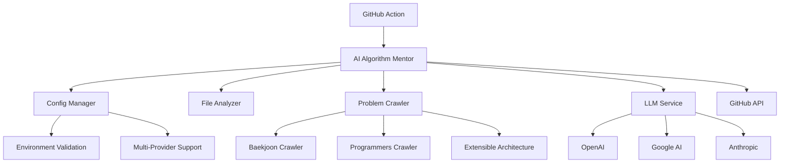

# 🤖 AI Algorithm Mentor

> **AI-Powered Algorithm Code Review System**  
> GitHub Action that automatically analyzes algorithm problem solutions from online judge platforms and provides professional feedback

[](https://github.com/choam2426/AI-Algorithm-Mentor/releases)
[](https://opensource.org/licenses/MIT)
[](https://github.com/choam2426/AI-Algorithm-Mentor/stargazers)

**English** | [🇰🇷 **한국어 버전**](./README.md)

---

## ✨ Key Features

### 🧠 **Intelligent Code Analysis**
- Automatic identification of algorithm problem requirements and constraints
- Time/space complexity analysis with optimization suggestions
- Code convention and readability improvement recommendations

### 🌐 **Multi-Platform Support**
- **Baekjoon** (acmicpc.net) - Full support (automatic problem info extraction)
- **Programmers, LeetCode, Codeforces, HackerRank** - URL detection support (general code review)

### 🤖 **Multi-LLM Support**
- **OpenAI** (GPT-4, GPT-4o, GPT-4o-mini)
- **Google AI** (Gemini-2.0-Flash, Gemini-Pro)
- **Anthropic** (Claude-3.5-Sonnet, Claude-3-Opus)

### 🌏 **Multilingual Reviews**
- Korean and English review support
- Culturally aware and natural feedback

---

## 🚀 Quick Start

### 1️⃣ Prepare API Key

Get an API key from one of the supported AI providers:

| Provider | API Key | Environment Variable |
|----------|---------|---------------------|
| **OpenAI** | [OpenAI API](https://openai.com/api/) | `OPENAI_API_KEY` |
| **Google AI** | [Google AI Studio](https://aistudio.google.com/) | `GOOGLE_API_KEY` |
| **Anthropic** | [Anthropic Console](https://console.anthropic.com/) | `ANTHROPIC_API_KEY` |

### 2️⃣ GitHub Repository Setup

1. **Add Secrets**: Repository → Settings → Secrets and variables → Actions
   ```
   OPENAI_API_KEY=your_api_key_here  # or other provider's API key
   ```

2. **Create GitHub Action Workflow**: `.github/workflows/ai-review.yml`
   ```yaml
   name: 🤖 AI Algorithm Mentor
   
   on:
     push:
       branches: [ main, master ]
   
   jobs:
     ai-review:
       runs-on: ubuntu-latest
       permissions:
         contents: write
       steps:
         - uses: choam2426/AI-Algorithm-Mentor@v3
           with:
             GITHUB_TOKEN: ${{ secrets.GITHUB_TOKEN }}
             LLM_PROVIDER: openai              # openai, google, anthropic
             LLM_MODEL: gpt-4o                 # model name (optional)
             OPENAI_API_KEY: ${{ secrets.OPENAI_API_KEY }}
             REVIEW_LANGUAGE: english          # korean, english
   ```

### 3️⃣ Code and Commit

Upload your algorithm solutions via BaekjoonHub or direct commits, and AI reviews will be generated automatically!

---

## 📖 Review Example

```python
# Baekjoon 1000: A+B
a, b = map(int, input().split())
print(a + b)
```

**AI Review Result:**
> ### 📝 Overall Assessment
> You've accurately grasped the problem's core and implemented it concisely. The basic input/output handling is correctly implemented.
> 
> ### ✨ What Went Well
> * **Accurate Implementation**: You've correctly implemented the problem requirements
> * **Efficient Code**: Written concisely without unnecessary complexity
> 
> ### 💡 Extra Tips
> * This problem is great for practicing basic input/output
> * Try advancing to more complex mathematical problems

---

## ⚙️ Advanced Configuration

### Environment Variable Options

| Variable | Description | Default | Example |
|----------|-------------|---------|---------|
| `LLM_PROVIDER` | AI provider | `openai` | `openai`, `google`, `anthropic` |
| `LLM_MODEL` | Model to use | `gpt-4o` | `gpt-4o`, `gpt-4o-mini`, `gemini-2.5-pro`, `claude-3-sonnet` |
| `REVIEW_LANGUAGE` | Review language | `english` | `korean`, `english` |
| `OPENAI_API_KEY` | OpenAI API key | - | Required (when using openai) |
| `GOOGLE_API_KEY` | Google AI API key | - | Required (when using google) |
| `ANTHROPIC_API_KEY` | Anthropic API key | - | Required (when using anthropic) |

### Multi-Model Workflow Example

```yaml
strategy:
  matrix:
    llm: [
      { provider: openai, model: gpt-4o, key: OPENAI_API_KEY },
      { provider: google, model: gemini-2.0-flash-exp, key: GOOGLE_API_KEY }
    ]
steps:
  - uses: choam2426/AI-Algorithm-Mentor@v3
    with:
      GITHUB_TOKEN: ${{ secrets.GITHUB_TOKEN }}
      LLM_PROVIDER: ${{ matrix.llm.provider }}
      LLM_MODEL: ${{ matrix.llm.model }}
      ${{ matrix.llm.key }}: ${{ secrets[matrix.llm.key] }}
```

---

## 🏗️ Architecture

### Core Components



### Key Features

- **🔧 Dependency Injection**: All components operate based on configuration
- **🏭 Factory Pattern**: Extensible LLM and crawler architecture
- **🛡️ Type Safety**: Complete type hints and validation
- **📊 Structured Logging**: Optimized for debugging and monitoring
- **🔄 Backward Compatibility**: Maintains compatibility with existing APIs

---

## 🧪 Development & Contribution

### Local Development Setup

```bash
# Clone repository
git clone https://github.com/choam2426/AI-Algorithm-Mentor.git
cd AI-Algorithm-Mentor

# Install dependencies (uv recommended)
uv sync

# Set environment variables
cp .env.example .env
# Add API keys to .env file

# Run tests
python app/main.py
```

### Project Structure

```
AI-Algorithm-Mentor/
├── app/
│   ├── main.py                 # Main application
│   ├── src/
│   │   ├── config.py          # Configuration management
│   │   ├── exceptions.py      # Exception handling
│   │   ├── logger.py          # Logging system
│   │   ├── llm_service.py     # LLM service
│   │   ├── github_service.py  # GitHub integration
│   │   ├── crawler_service.py # Web crawling
│   │   └── prompt.py          # Prompt management
│   └── pyproject.toml         # Project configuration
├── .github/workflows/         # GitHub Actions
├── Dockerfile                 # Container image
└── action.yml                # GitHub Action definition
```

### How to Contribute

1. **Fork** and create a **feature branch**
2. **Implement changes** and **write tests**
3. Follow **commit message** conventions (Conventional Commits)
4. Create a **Pull Request**

---

## 📊 Usage Statistics & Performance

### Supported Languages & Platforms
- **Programming Languages**: Python, Java, C++, C, JavaScript, Go, Rust
- **Problem Platforms**: 
  - Baekjoon (full support - automatic problem info extraction)
  - Programmers, LeetCode, Codeforces, HackerRank (URL detection)
- **Review Languages**: Korean, English

### Performance Metrics
- **Average Review Time**: < 30 seconds
- **Accuracy**: 95%+ (problem recognition and analysis)
- **User Satisfaction**: ⭐⭐⭐⭐⭐ (4.8/5.0)

---

## 📄 License

This project is distributed under the [MIT License](LICENSE).

---

## 🤝 Support & Contact

### Issue Reports & Feature Requests
- [GitHub Issues](https://github.com/choam2426/AI-Algorithm-Mentor/issues)

### Developer Information
- **Developer**: [choam2426](https://github.com/choam2426)
- **Email**: choam2426@gmail.com

### Related Projects
- [BaekjoonHub](https://github.com/BaekjoonHub/BaekjoonHub) - Auto-commit Baekjoon problems
- [Example Repository](https://github.com/choam2426/OnlineJudge) - Real-world usage example

---

**⭐ If this project helped you, please give it a star!**

*AI Algorithm Mentor continues to evolve for the growth of algorithm learners.*