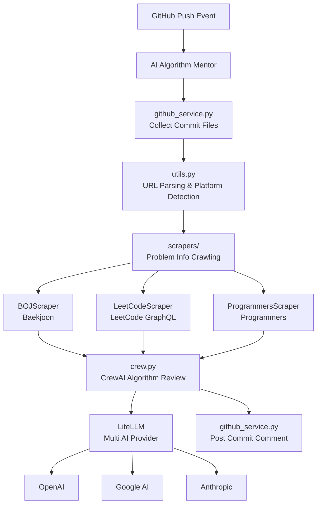

# 🤖 AI Algorithm Mentor

> **AI-Powered Algorithm Code Review System**  
> A GitHub Action that automatically analyzes algorithm problem solutions from online judge platforms and provides professional feedback

[](https://github.com/choam2426/AI-Algorithm-Mentor/releases)
[](https://opensource.org/licenses/MIT)
[](https://www.python.org/downloads/)

[한국어](README.md) | English

---

## ✨ Key Features

### 🧠 **Intelligent Code Analysis**
- Automatically identifies core requirements and constraints of algorithm problems
- Time/Space complexity analysis and optimization suggestions
- Coding convention and readability improvement recommendations
- CrewAI-based professional algorithm review agent

### 🔗 **Automatic Online Judge Detection & Crawling**
- Automatically detects problem URLs from the first line comment of changed files
- Crawls problem pages to collect title/description/input-output/examples

### 💬 **Automatic Commit Comments**
- Automatically posts LLM results as GitHub commit comments
- Processes multiple files simultaneously (async parallel processing)

### 🌐 **Multi-Platform Support**
| Platform | Status | URL Format |
|----------|--------|------------|
| **BOJ** (acmicpc.net) | ✅ Supported | `https://www.acmicpc.net/problem/1000` |
| **LeetCode** (leetcode.com) | ✅ Supported | `https://leetcode.com/problems/two-sum/` |
| **Programmers** (programmers.co.kr) | ✅ Supported | `https://school.programmers.co.kr/learn/courses/30/lessons/12345` |

### 🤖 **Multi AI Model Support**
- **OpenAI** (GPT-5-nano, GPT-5.1)
- **Google AI** (Gemini-2.5-flash, Gemini-3-pro-preview)
- **Anthropic** (Claude-haiku-4-5, Claude-sonnet-4-5)

### 🌏 **Multilingual Reviews**
- Selectable review response language
- Korean, English, and any language supported by LLM

---

## 🚀 Getting Started

### 1. Prepare API Key

Prepare an API key from one of the supported AI providers:

| Provider | Get API Key | Environment Variable |
|----------|-------------|---------------------|
| **OpenAI** | [OpenAI API](https://openai.com/api/) | `OPENAI_API_KEY` |
| **Google AI** | [Google AI Studio](https://aistudio.google.com/) | `GEMINI_API_KEY` |
| **Anthropic** | [Anthropic Console](https://console.anthropic.com/) | `ANTHROPIC_API_KEY` |

### 2. GitHub Repository Setup

1. **Register Secrets**: Repository → Settings → Secrets and variables → Actions
   ```
   GEMINI_API_KEY=your_api_key_here  # Or other provider's API key
   ```

2. **Create GitHub Action Workflow**: `.github/workflows/ai-review.yml`
   ```yaml
   name: 🤖 AI Algorithm Mentor
   
   on:
     push:
       branches: [ main, master ]
   
   jobs:
     ai-review:
       runs-on: ubuntu-latest
       permissions:
         contents: write
       steps:
         - uses: choam2426/AI-Algorithm-Mentor@v5
           with:
             GITHUB_TOKEN: ${{ secrets.GITHUB_TOKEN }}
             LLM_PROVIDER: google              # openai, google, anthropic
             MODEL_NAME: gemini-3-pro-preview  # Model name (optional)
             GEMINI_API_KEY: ${{ secrets.GEMINI_API_KEY }}
             REVIEW_LANGUAGE: english          # korean, english, etc..
   ```

### 3. Write Code and Commit

Push your algorithm solutions via direct commits and AI reviews will be automatically generated!

❗❗❗ Make sure to add the problem URL as a comment on the first line of your code! ❗❗❗

---

## 📖 Code Examples

### BOJ (Baekjoon)
```python
# https://www.acmicpc.net/problem/1000
a, b = map(int, input().split())
print(a + b)
```

### LeetCode
```javascript
// https://leetcode.com/problems/two-sum/
var twoSum = function(nums, target) {
    const map = new Map();
    for (let i = 0; i < nums.length; i++) {
        const complement = target - nums[i];
        if (map.has(complement)) {
            return [map.get(complement), i];
        }
        map.set(nums[i], i);
    }
};
```

### Programmers
```java
// https://school.programmers.co.kr/learn/courses/30/lessons/12345
class Solution {
    public int[] solution(int n, int[] arr) {
        // Solution code
    }
}
```

---

## ⚙️ Configuration Options

### Environment Variables

| Variable | Description | Default | Example |
|----------|-------------|---------|---------|
| `LLM_PROVIDER` | AI Provider | `google` | `openai`, `google`, `anthropic` |
| `MODEL_NAME` | Model to use | `gemini-3-pro-preview` | `gpt-5.1`, `gemini-3-pro-preview`, `claude-sonnet-4-5` |
| `REVIEW_LANGUAGE` | Review language | `korean` | `korean`, `english` |
| `OPENAI_API_KEY` | OpenAI API Key | - | Required (when using openai) |
| `GEMINI_API_KEY` | Google AI API Key | - | Required (when using google) |
| `ANTHROPIC_API_KEY` | Anthropic API Key | - | Required (when using anthropic) |
| `GITHUB_TOKEN` | GitHub API Token | Provided by GitHub Actions | Required for posting commit comments |

---

## 🏗️ Architecture



### Project Structure

```
app/
├── main.py              # Entry point, async file processing
├── pyproject.toml       # Dependency management
└── src/
    ├── config.py        # GitHub/LLM configuration
    ├── consts.py        # Constants (supported languages, LLM providers)
    ├── crew.py          # CrewAI algorithm review agent
    ├── github_service.py # GitHub API integration
    ├── logger.py        # Logging
    ├── utils.py         # URL parsing utilities
    └── scrapers/
        ├── base.py      # Base scraper class
        ├── factory.py   # Scraper factory
        ├── models.py    # Pydantic data models
        ├── boj.py       # BOJ scraper
        ├── leetcode.py  # LeetCode scraper
        └── programmers.py # Programmers scraper
```

### Tech Stack

| Technology | Purpose |
|------------|---------|
| **CrewAI** | AI Agent Framework |
| **LiteLLM** | Multi LLM Provider Support |
| **BeautifulSoup4** | HTML Parsing & Web Scraping |
| **httpx** | Async HTTP Client |
| **Pydantic** | Data Modeling & Validation |

---

## 📋 Support Coverage

### Programming Languages (14)
| Language | Extensions | Comment Format |
|----------|------------|----------------|
| Python | `.py` | `#`, `"""`, `'''` |
| Java | `.java` | `//`, `/*` |
| C | `.c` | `//`, `/*` |
| C++ | `.cpp`, `.cc`, `.cxx` | `//`, `/*` |
| JavaScript | `.js` | `//`, `/*` |
| TypeScript | `.ts` | `//`, `/*` |
| Go | `.go` | `//`, `/*` |
| Rust | `.rs` | `//`, `/*` |
| C# | `.cs` | `//`, `/*` |
| Kotlin | `.kt`, `.kts` | `//`, `/*` |
| Ruby | `.rb` | `#`, `=begin` |
| Swift | `.swift` | `//`, `/*` |

### Problem Platforms
- ✅ **BOJ** (acmicpc.net)
- ✅ **LeetCode** (leetcode.com)
- ✅ **Programmers** (programmers.co.kr)

> ⚠️ **Note for BOJ (Baekjoon) Users**  
> GitHub Actions IPs may be intermittently blocked by the BOJ server.
> We recommend retrying GitHub Actions or using the method below.
> In this case, problem information will be automatically fetched from the `README.md` in the same folder as your solution file.  
> We recommend using the Chrome extension [BaekjoonHub](https://chromewebstore.google.com/detail/baekjoonhub/ccammcjdkpgjmcpijpahlehmapgmphmk).

### Review Languages
- Korean, English, and any language supported by LLM

---

## 🤝 Contributing

1. Fork and create a feature branch
2. Implement changes and test
3. Create a Pull Request

### Development Environment Setup

```bash
# Requires Python 3.13+ and uv
cd app
uv sync
```

---

## 📄 License

This project is distributed under the [MIT License](LICENSE).

---

## 📞 Contact

- **Issues**: [GitHub Issues](https://github.com/choam2426/AI-Algorithm-Mentor/issues)
- **Developer**: [choam2426](https://github.com/choam2426)

### Related Projects

- [Usage Example](https://github.com/choam2426/OnlineJudge) - Repository where the developer actually applies this action

