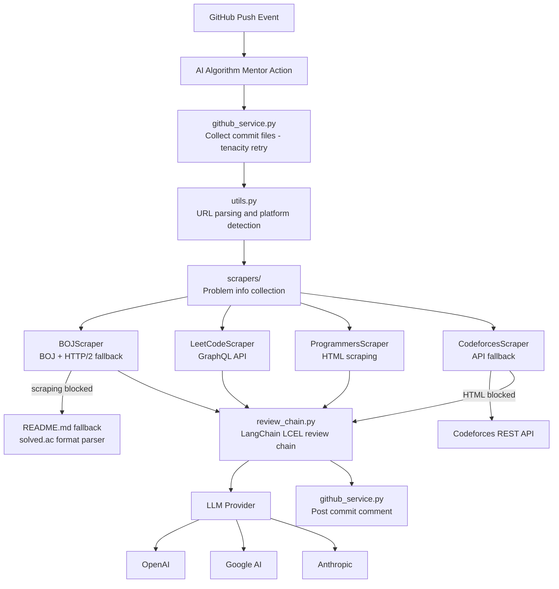

# AI Algorithm Mentor

> An AI-powered algorithm code review GitHub Action.
> Commit your algorithm solution and get professional feedback posted automatically as a commit comment.

[](https://github.com/choam2426/AI-Algorithm-Mentor/releases)
[](https://opensource.org/licenses/MIT)
[](https://www.python.org/downloads/)

[한국어](README.md) | English

---

## Key Features

- **Intelligent code analysis** — A LangChain LCEL review chain evaluates time/space complexity, correctness, and code quality.
- **4-platform auto-detection** — Reads the URL comment on the first line of your code to identify the platform and problem.
- **Automatic problem info collection** — Scrapes the problem title, description, input/output specs, and sample cases.
- **README.md fallback** — If scraping is blocked, reads problem info from a `README.md` in the same folder.
- **Automatic commit comments** — Posts the review directly as a GitHub commit comment.
- **Parallel processing** — Handles multiple files in a single commit concurrently with async I/O.
- **3 AI providers** — Choose between OpenAI, Google AI, and Anthropic.
- **Multilingual reviews** — Get reviews in Korean, English, or any language the LLM supports.

---

## Supported Platforms

| Platform | Status | URL Format |
|----------|--------|------------|
| **BOJ** (acmicpc.net) | Supported | `https://www.acmicpc.net/problem/1000` |
| **LeetCode** (leetcode.com) | Supported | `https://leetcode.com/problems/two-sum/` |
| **Programmers** (programmers.co.kr) | Supported | `https://school.programmers.co.kr/learn/courses/30/lessons/12345` |
| **Codeforces** (codeforces.com) | Supported | `https://codeforces.com/problemset/problem/1/A` |

---

## Quick Start (5 minutes)

### Step 1: Get an API Key

Pick one AI provider and get an API key.

| Provider | Link | Secret Name |
|----------|------|-------------|
| **Google AI** (default) | [Google AI Studio](https://aistudio.google.com/) | `GEMINI_API_KEY` |
| **OpenAI** | [OpenAI API](https://openai.com/api/) | `OPENAI_API_KEY` |
| **Anthropic** | [Anthropic Console](https://console.anthropic.com/) | `ANTHROPIC_API_KEY` |

### Step 2: Add a GitHub Secret

Go to your repository: **Settings → Secrets and variables → Actions → New repository secret**

```
GEMINI_API_KEY = your_api_key_here
```

### Step 3: Create the Workflow File

Create `.github/workflows/ai-review.yml` and paste the following:

```yaml
name: AI Algorithm Mentor

on:
  push:
    branches: [ main, master ]

jobs:
  ai-review:
    runs-on: ubuntu-latest
    permissions:
      contents: write
    steps:
      - uses: choam2426/AI-Algorithm-Mentor@v5
        with:
          GITHUB_TOKEN: ${{ secrets.GITHUB_TOKEN }}
          LLM_PROVIDER: google
          MODEL_NAME: gemini-3.1-flash
          GEMINI_API_KEY: ${{ secrets.GEMINI_API_KEY }}
          REVIEW_LANGUAGE: english
```

### Step 4: Write Code and Push

Add the problem URL as a comment on the very first line of your solution, then commit and push. That's it — the review appears on your commit automatically.

> If the first line has no URL comment, the file is skipped.

---

## Code Examples

### BOJ (Baekjoon Online Judge)

```python
# https://www.acmicpc.net/problem/1000
a, b = map(int, input().split())
print(a + b)
```

### LeetCode

```javascript
// https://leetcode.com/problems/two-sum/
var twoSum = function(nums, target) {
    const map = new Map();
    for (let i = 0; i < nums.length; i++) {
        const complement = target - nums[i];
        if (map.has(complement)) return [map.get(complement), i];
        map.set(nums[i], i);
    }
};
```

### Programmers

```java
// https://school.programmers.co.kr/learn/courses/30/lessons/12345
class Solution {
    public int[] solution(int n, int[] arr) {
        // solution code
    }
}
```

### Codeforces

```cpp
// https://codeforces.com/problemset/problem/1/A
#include <bits/stdc++.h>
using namespace std;
int main() {
    // solution code
}
```

---

## Configuration Options

| Input | Description | Default |
|-------|-------------|---------|
| `LLM_PROVIDER` | AI provider to use | `google` |
| `MODEL_NAME` | Model name | `gemini-3.1-flash` |
| `REVIEW_LANGUAGE` | Language for the review | `korean` |
| `OPENAI_API_KEY` | OpenAI API key | — |
| `GEMINI_API_KEY` | Google AI API key | — |
| `ANTHROPIC_API_KEY` | Anthropic API key | — |
| `GITHUB_TOKEN` | GitHub token (auto-provided by Actions) | — |

Supported models:

| Provider | Models |
|----------|--------|
| Google | `gemini-3.1-flash`, `gemini-3.1-pro` |
| OpenAI | `gpt-5.4-mini`, `gpt-5.4-nano` |
| Anthropic | `claude-sonnet-4-6`, `claude-haiku-4-5` |

---

## Browser Extension Recommendations

**BOJ and Codeforces may block GitHub Actions IPs via Cloudflare.** When that happens, the action cannot scrape problem details directly. Instead, it falls back to reading a `README.md` file in the same folder as your solution.

The extensions below automatically generate that `README.md` whenever you submit a correct answer, so the fallback works seamlessly.

### For BOJ: BaekjoonHub

[BaekjoonHub](https://github.com/BaekjoonHub/BaekjoonHub) pushes your accepted solution and a `README.md` with the full problem description to GitHub automatically.

- This is the most reliable way to handle Cloudflare blocking on BOJ.
- Install: [Chrome Web Store](https://chromewebstore.google.com/detail/baekjoonhub/ccammcjdkpgjmcpijpahlehmapgmphmk)

### For Codeforces: CFPusher

[CFPusher](https://chromewebstore.google.com/detail/cfpusher-codeforces-to-gi/eiffefcjnaanflbhcmgjlaoilhpkbael) pushes accepted Codeforces submissions to GitHub automatically.

- Codeforces blocks most non-browser HTTP requests, so this extension is strongly recommended.
- As long as the pushed file has a URL comment on the first line, the review starts automatically.

> **How the fallback works**: scraping fails → check for `README.md` in the same folder → parse problem info → run review. If no `README.md` exists, the file is skipped.

---

## Live Examples

- [Example 1 — BOJ review](https://github.com/choam2426/OnlineJudge/commit/09d4753fb1957cf70188a9d8fdbd3873e925a778#commitcomment-172865735)
- [Example 2 — LeetCode review](https://github.com/choam2426/OnlineJudge/commit/0e0e8c94dabf407a38a559c52eb19a3cebe8adda#commitcomment-172867307)
- [Developer's solution repository](https://github.com/choam2426/OnlineJudge)

---

## Architecture


```mermaid
graph TD
    A[GitHub Push Event] --> B[AI Algorithm Mentor Action]
    B --> C[github_service.py<br/>Collect commit files - tenacity retry]
    C --> D[utils.py<br/>URL parsing and platform detection]
    D --> E[scrapers/<br/>Problem info collection]

    E --> E1[BOJScraper<br/>BOJ + HTTP/2 fallback]
    E --> E2[LeetCodeScraper<br/>GraphQL API]
    E --> E3[ProgrammersScraper<br/>HTML scraping]
    E --> E4[CodeforcesScraper<br/>API fallback]

    E1 -->|scraping blocked| F1[README.md fallback<br/>solved.ac format parser]
    E4 -->|HTML blocked| F2[Codeforces REST API]

    E1 & E2 & E3 & E4 --> G[review_chain.py<br/>LangChain LCEL review chain]

    G --> H[LLM Provider]
    H --> H1[OpenAI]
    H --> H2[Google AI]
    H --> H3[Anthropic]

    G --> I[github_service.py<br/>Post commit comment]
```

---

## Project Structure

```
app/
├── main.py                  # Entry point, async parallel file processing
├── pyproject.toml           # Dependency management
└── src/
    ├── config.py            # GitHub / LLM configuration
    ├── consts.py            # Supported languages and provider constants
    ├── review_chain.py      # LangChain LCEL review chain
    ├── github_service.py    # GitHub API integration (tenacity retry)
    ├── logger.py            # Logging
    ├── utils.py             # URL parsing, README parsing utilities
    └── scrapers/
        ├── base.py          # Base scraper class
        ├── factory.py       # Platform scraper selector
        ├── models.py        # Pydantic data models
        ├── boj.py           # BOJ scraper (HTTP/1.1 + HTTP/2 fallback)
        ├── leetcode.py      # LeetCode GraphQL scraper
        ├── programmers.py   # Programmers HTML scraper
        └── codeforces.py    # Codeforces scraper (API fallback)

tests/
└── ...                      # pytest unit tests (32 tests)
```

---

## Tech Stack

| Technology | Purpose |
|------------|---------|
| **LangChain LCEL** | LLM review chain composition |
| **httpx** | Async HTTP client with HTTP/2 support |
| **BeautifulSoup4** | HTML parsing and web scraping |
| **Pydantic** | Data modeling and validation |
| **tenacity** | Retry logic for GitHub API calls |
| **pytest** | Unit tests (32 tests) |

---

## Supported Languages

| Language | Extensions | Comment Format |
|----------|------------|----------------|
| Python | `.py` | `#`, `"""`, `'''` |
| Java | `.java` | `//`, `/*` |
| C | `.c` | `//`, `/*` |
| C++ | `.cpp`, `.cc`, `.cxx` | `//`, `/*` |
| JavaScript | `.js` | `//`, `/*` |
| TypeScript | `.ts` | `//`, `/*` |
| Go | `.go` | `//`, `/*` |
| Rust | `.rs` | `//`, `/*` |
| C# | `.cs` | `//`, `/*` |
| Kotlin | `.kt`, `.kts` | `//`, `/*` |
| Ruby | `.rb` | `#`, `=begin` |
| Swift | `.swift` | `//`, `/*` |

---

## Contributing

1. Fork this repository.
2. Create a feature branch: `git checkout -b feature/my-feature`
3. Implement your changes and run the tests.
4. Open a Pull Request.

### Development Setup

```bash
# Requires Python 3.13+ and uv
cd app
uv sync
```

---

## License

This project is released under the [MIT License](LICENSE).

---

## Contact

- **Issues**: [GitHub Issues](https://github.com/choam2426/AI-Algorithm-Mentor/issues)
- **Developer**: [choam2426](https://github.com/choam2426)
